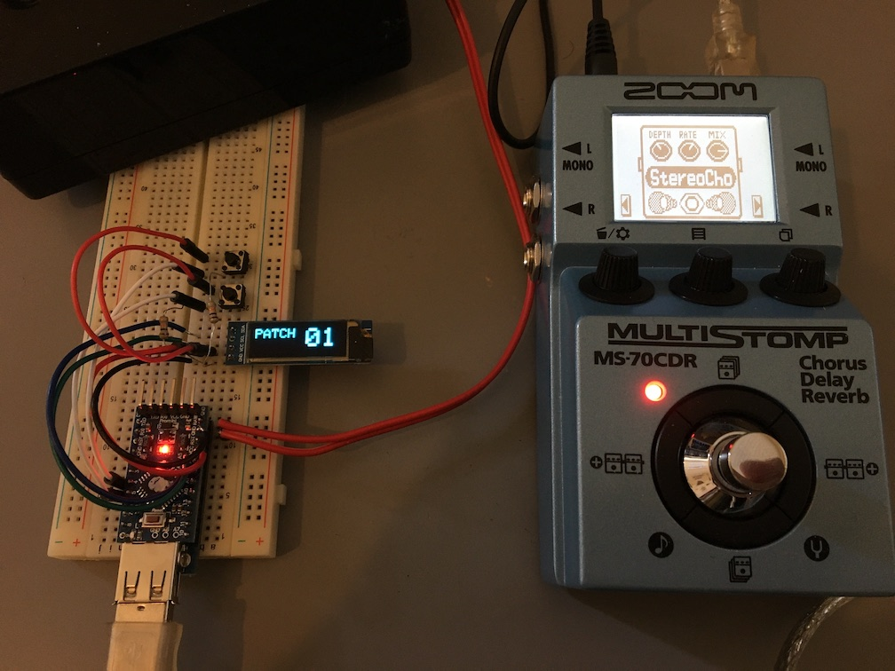

# Zoom MultiStomp Patch Changer

Change the current patch of your Zoom MultiStomp pedal using an Arduino Pro Mini, a USB Host Shield module, and your feet :)

### Bill of materials
- [Arduino Pro Mini (3.3v version)](img/APMv33.jpg)
- [USB Host Shield v2.0](img/UHSv2.jpg)
- [128x32 OLED screen](img/OLED.jpg)
- 2x push buttons or momentary footswitches
- 2x 10k resistors
- Dual 9v power supply
- USB-A to USB-Mini cable
- FTDI breakout board (configured for 3.3v) for code upload

### Wiring
- The USB Host Shield should be soldered under (or above) the Arduino board; USB-A port facing one side, Arduino programming header facing the other (see pic)
- A4 and A5 pins should be wired to SDA / SCL on the OLED board; power is supplied using Arduino's VCC pin.
- Button pins are wired to digital pins 4 and 5 using 10k resistors for pull-down.
- 9v power is supplied to the Arduino (through the RAW pin), and to the Zoom device.

### TODOs and issues

- This has been tested on the MS-70CDR model only.
- The first button pushes seem to be ignored by the Zoom. It'll respond after a few seconds.
- When changing the current patch on the Zoom itself, the internal state of the controller should be updated as well.
- The USB Host Shield could be modded so that +5v power with sufficient current is sent through the USB port, thus removing the need for the Zoom's power supply.

